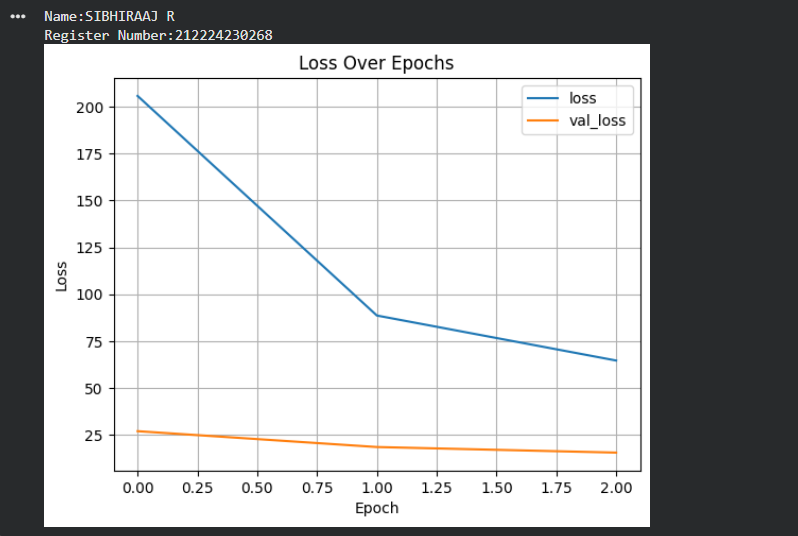
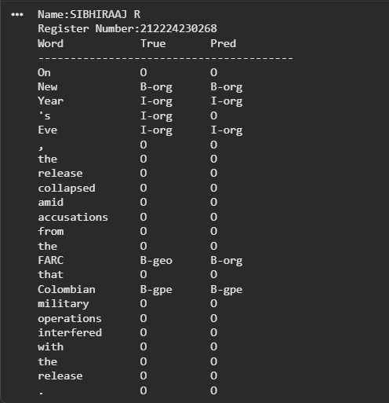

# DL- Developing a Deep Learning Model for NER using LSTM

## AIM
To develop an LSTM-based model for recognizing the named entities in the text.

## Problem Statement and Dataset
An organization needs to extract important information such as names of people, locations, organizations, and other entities from large amounts of unstructured text data. Manually identifying these named entities is time-consuming and inefficient.
To automate this process, a model based on Long Short-Term Memory (LSTM) networks will be developed. LSTM is a type of recurrent neural network that is capable of capturing long-term dependencies in sequential data, making it suitable for natural language processing tasks.
The model will be trained on labeled text data where each word is tagged with its corresponding entity type. By learning the context and relationships between words in a sentence, the model can accurately identify and classify named entities.
After training, the model will be tested on new, unseen text to evaluate its performance in recognizing entities. The objective is to achieve high accuracy in extracting relevant information from text data efficiently.


## DESIGN STEPS
STEP 1: Collect and Prepare Dataset
Obtain a labeled text dataset where each word is tagged with its entity label (e.g., Person, Location, Organization, O).

STEP 2: Text Preprocessing
Tokenize the sentences into words, convert them into numerical representations, and create vocabulary indices.

STEP 3: Generate Word Embeddings
Convert each word into dense vectors using embedding techniques such as Word Embedding from libraries like Word2Vec or GloVe.

STEP 4: Build the LSTM Model
Construct an LSTM-based neural network consisting of an embedding layer, one or more LSTM layers, and a dense layer with a softmax activation for entity classification.

STEP 5: Train the Model
Train the LSTM using the labeled sequences to learn contextual relationships between words and their corresponding entity tags.

STEP 6: Predict and Evaluate
Apply the trained model to new sentences to identify named entities and evaluate performance using metrics such as precision, recall, and F1-score.


## PROGRAM

### Name: SIBHIRAAJ R

### Register Number: 212224230268

```
import pandas as pd
import torch
import torch.nn as nn
import numpy as np
import matplotlib.pyplot as plt
from torch.utils.data import Dataset, DataLoader
from sklearn.model_selection import train_test_split
from sklearn.metrics import classification_report
from torch.nn.utils.rnn import pad_sequence
import warnings
warnings.filterwarnings("ignore", category=DeprecationWarning)

# Device configuration
device = torch.device("cuda" if torch.cuda.is_available() else "cpu")
print(f"Using device: {device}")

# Load and prepare data
data = pd.read_csv("ner_dataset.csv", encoding="latin1").ffill()
words = list(data["Word"].unique())
tags = list(data["Tag"].unique())

if "ENDPAD" not in words:
    words.append("ENDPAD")

word2idx = {w: i + 1 for i, w in enumerate(words)}
tag2idx = {t: i for i, t in enumerate(tags)}
idx2tag = {i: t for t, i in tag2idx.items()}

data.head(50)

print("Unique words in corpus:", data['Word'].nunique())
print("Unique tags in corpus:", data['Tag'].nunique())

print("Unique tags are:", tags)

# Group words by sentences
class SentenceGetter:
    def __init__(self, data):
        self.grouped = data.groupby("Sentence #", group_keys=False).apply(
            lambda s: [(w, t) for w, t in zip(s["Word"], s["Tag"])]
        )
        self.sentences = list(self.grouped)

getter = SentenceGetter(data)
sentences = getter.sentences

sentences[35]

# Encode sentences
X = [[word2idx[w] for w, t in s] for s in sentences]
y = [[tag2idx[t] for w, t in s] for s in sentences]

word2idx

plt.hist([len(s) for s in sentences], bins=50)
plt.show()

# Pad sequences
max_len = 50
X_pad = pad_sequence([torch.tensor(seq) for seq in X], batch_first=True, padding_value=word2idx["ENDPAD"])
y_pad = pad_sequence([torch.tensor(seq) for seq in y], batch_first=True, padding_value=tag2idx["O"])
X_pad = X_pad[:, :max_len]
y_pad = y_pad[:, :max_len]

X_pad[0]

y_pad[0]

# Train/test split
X_train, X_test, y_train, y_test = train_test_split(X_pad, y_pad, test_size=0.2, random_state=1)

# Dataset class
class NERDataset(Dataset):
    def __init__(self, X, y):
        self.X = X
        self.y = y

    def __len__(self):
        return len(self.X)

    def __getitem__(self, idx):
        return {
            "input_ids": self.X[idx],
            "labels": self.y[idx]
        }

train_loader = DataLoader(NERDataset(X_train, y_train), batch_size=32, shuffle=True)
test_loader = DataLoader(NERDataset(X_test, y_test), batch_size=32)

class BiLSTMTagger(nn.Module):
    def __init__(self, vocab_size, tagset_size, embedding_dim=50, hidden_dim=100):
        super(BiLSTMTagger, self).__init__()
        self.embedding = nn.Embedding(vocab_size, embedding_dim)
        self.dropout = nn.Dropout(0.1)
        self.lstm=nn.LSTM(embedding_dim, hidden_dim, batch_first=True, bidirectional=True)
        self.fc = nn.Linear(hidden_dim*2, tagset_size)


    def forward(self, x):
        x=self.embedding(x)
        x=self.dropout(x)
        x,_=self.lstm(x)
        return self.fc(x)

model = BiLSTMTagger(len(word2idx)+1, len(tag2idx)).to(device)
loss_fn = nn.CrossEntropyLoss()
optimizer = torch.optim.Adam(model.parameters(), lr=0.001)

# Training and Evaluation Functions
def train_model(model, train_loader, test_loader, loss_fn, optimizer, epochs=3):
    train_losses, val_losses = [], []
    for epoch in range(epochs):
      model.train()
      total_train_loss = 0
      for batch in train_loader:
        input_ids = batch["input_ids"].to(device)
        labels = batch["labels"].to(device)
        optimizer.zero_grad()
        outputs = model(input_ids)
        loss = loss_fn(outputs.view(-1, len(tag2idx)), labels.view(-1))
        loss.backward()
        optimizer.step()
        total_train_loss += loss.item()
      avg_train_loss = total_train_loss / len(train_loader)
      train_losses.append(avg_train_loss)

      model.eval()
      total_val_loss = 0
      with torch.no_grad():
        for batch in test_loader:
          input_ids = batch["input_ids"].to(device)
          labels = batch["labels"].to(device)
          outputs = model(input_ids)
          loss = loss_fn(outputs.view(-1, len(tag2idx)), labels.view(-1))
          total_val_loss += loss.item()
      avg_val_loss = total_val_loss / len(test_loader)
      val_losses.append(avg_val_loss)
      print(f"Epoch {epoch+1}: Train Loss={avg_train_loss:.4f}, Val Loss={avg_val_loss:.4f}")

    return train_losses, val_losses

def evaluate_model(model, test_loader, X_test, y_test):
    model.eval()
    true_tags, pred_tags = [], []
    with torch.no_grad():
        for batch in test_loader:
            input_ids = batch["input_ids"].to(device)
            labels = batch["labels"].to(device)
            outputs = model(input_ids)
            preds = torch.argmax(outputs, dim=-1)
            for i in range(len(labels)):
                for j in range(len(labels[i])):
                    if labels[i][j] != tag2idx["O"]:
                        true_tags.append(idx2tag[labels[i][j].item()])
                        pred_tags.append(idx2tag[preds[i][j].item()])

# Run training and evaluation
train_losses, val_losses = train_model(model, train_loader, test_loader, loss_fn, optimizer, epochs=3)
evaluate_model(model, test_loader, X_test, y_test)

# Plot loss
print('Name: SIBHIRAAJ R')
print('Register Number: 212224230268')
history_df = pd.DataFrame({"loss": train_losses, "val_loss": val_losses})
history_df.plot(title="Loss Over Epochs")
plt.xlabel("Epoch")
plt.ylabel("Loss")
plt.grid(True)
plt.show()

# Inference and prediction
i = 125
model.eval()
sample = X_test[i].unsqueeze(0).to(device)
output = model(sample)
preds = torch.argmax(output, dim=-1).squeeze().cpu().numpy()
true = y_test[i].numpy()

print('Name:                 ')
print('Register Number:     ')
print("{:<15} {:<10} {}\n{}".format("Word", "True", "Pred", "-" * 40))
for w_id, true_tag, pred_tag in zip(X_test[i], y_test[i], preds):
    if w_id.item() != word2idx["ENDPAD"]:
        word = words[w_id.item() - 1]
        true_label = tags[true_tag.item()]
        pred_label = tags[pred_tag]
        print(f"{word:<15} {true_label:<10} {pred_label}")


```
## Loss Vs Epoch Plot




### Sample Text Prediction


## RESULT
This program has been executed successfully.
